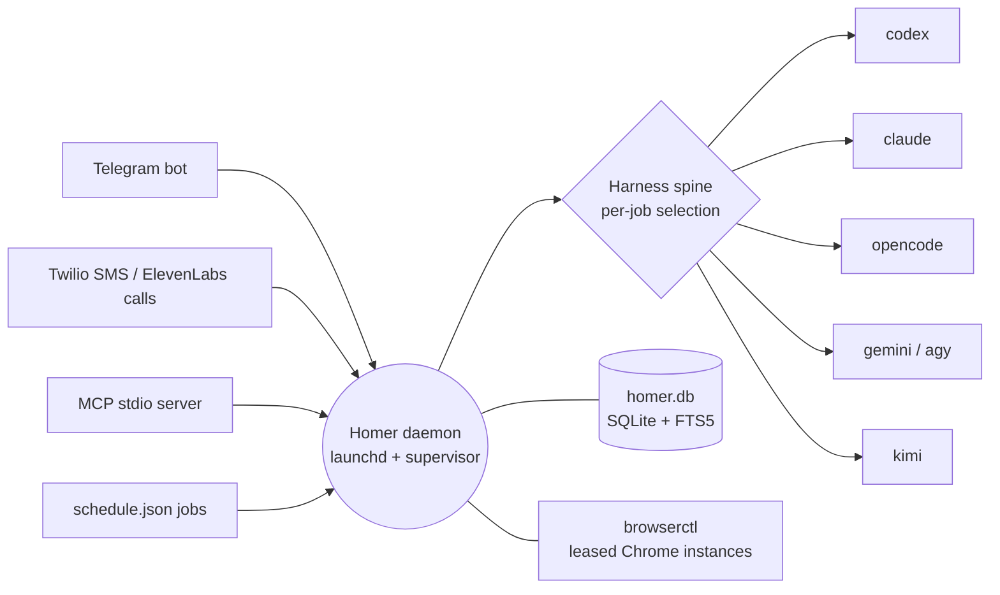

<h1 align="center">Homer</h1>

<p align="center"><b>Hybrid Orchestration for Multi-model Execution and Routing.</b><br>
A personal AI daemon that turns several agent CLIs into one addressable assistant<br>
with persistent memory, scheduled jobs, and chat, phone and MCP entry points.</p>

<p align="center">
<a href="#what-a-clone-can-and-cannot-do"><b>Read this first</b></a> ·
<a href="docs/harness-independence.md"><b>How routing works</b></a> ·
<a href="#skills">Write a skill</a> ·
<a href="docs/telephony.md">Telephony</a>
</p>

---

## The idea

Coding agents such as Claude Code, Codex, OpenCode, Gemini (through `agy`) and Kimi are each good at something, and Homer maintains shared continuity across them. It is the process that stays up between sessions. It runs 24/7 on one Mac under launchd, keeps a SQLite memory, runs jobs on a cron schedule, and chooses which CLI handles each job from a database table rather than from hard-coded calls.

This repository is the **shell**: the daemon framework, scheduler, executors, browser broker, skill renderer and the tooling around them. Everything specific to one operator, such as their skills, their jobs, personal bins and configs, lives in a separate unpublished checkout that plugs in through the [private overlay](#private-overlay).



## What a clone can and cannot do

This is a personal system published as a reference, not a product. It runs on one Mac mini against one person's memory, inbox and tools. Interfaces, schema and tools change without notice.

**A public clone does not build on its own.** Several subsystems the daemon imports are kept out of the public snapshot and listed in the "Personal subsystems" block at the end of [`.gitignore`](.gitignore). Examples:

| Missing from this repo | Imported by |
|---|---|
| `src/memory/` | `src/index.ts`, `src/mcp/server.ts` |
| `src/telephony/` (including the `/health` server) | `src/index.ts` |
| `src/mcp/tools/memory.ts`, `src/mcp/tools/calls.ts` | `src/mcp/server.ts` |
| `bin/browser-process-groups.mjs` | `bin/browserctl` |

`npm run check` and `npm test` also call `test:abvp`, which runs a test script inside the private overlay (`${HOMER_PRIVATE_ROOT:-../homer-private}`).

What you can do with a clone:

1. Read the architecture: [`src/scheduler/`](src/scheduler), [`src/executors/`](src/executors), [`src/harness/`](src/harness), [`src/state/migrations/`](src/state/migrations).
2. Borrow the patterns: harness-independent job routing ([`docs/harness-independence.md`](docs/harness-independence.md)), the launchd supervisor ([`scripts/daemon-supervisor.mjs`](scripts/daemon-supervisor.mjs)), the private-overlay loader ([`src/private-overlay.ts`](src/private-overlay.ts)) and the skill renderer ([`scripts/render-harness-assets.ts`](scripts/render-harness-assets.ts)).
3. Use it as the base for your own daemon, supplying the missing modules yourself.

## What it does

| Area | What the code does | Where |
|---|---|---|
| Process | Runs as the launchd agent `com.homer.daemon` under a resident supervisor with a single-instance lock and restart requests | [`config/`](config), [`scripts/install-daemon.sh`](scripts/install-daemon.sh), [`src/daemon/`](src/daemon) |
| Entry points | Telegram bot (grammY), telephony webhooks (Twilio SMS, ElevenLabs Conversational AI), and an MCP stdio server | [`src/bot/`](src/bot), [`docs/telephony.md`](docs/telephony.md), [`src/mcp/`](src/mcp) |
| Scheduling | Cron jobs from hot-reloaded `schedule.json` files. Internal handlers, CLI-run skills and overlay jobs share one registry | [`src/scheduler/registry.ts`](src/scheduler/registry.ts) |
| Routing | Each job's harness and model is resolved at call time from a database table plus per-job baselines. Switching a job between CLIs is a data change | [`docs/harness-independence.md`](docs/harness-independence.md), [`src/scheduler/harness-baselines.ts`](src/scheduler/harness-baselines.ts) |
| Memory | Claims such as facts, decisions and lessons live in SQLite with FTS5. Canonical documents live in `~/memory/*.md` | [`src/state/`](src/state) (the memory service itself is private) |
| Browser | Resident Chrome instances shared between agents through `bin/browserctl` leases, with session stewardship for surfaces the overlay declares | [`bin/browserctl`](bin/browserctl); broker implementation is private |

**Stack:** Node.js 24+ ([`.node-version`](.node-version)), TypeScript ESM, `better-sqlite3`, Zod, grammY, Fastify (telephony only), Playwright, `@modelcontextprotocol/sdk`, Anthropic/OpenAI/Google SDKs, Azure Blob for media. The full list is in [`package.json`](package.json).

## Running it (full tree only)

These steps assume you have the private subsystems listed above, or your own replacements for them. They require macOS, Node.js 24+ and the Xcode Command Line Tools (`xcode-select --install`) for the native `better-sqlite3` and `fs-ext` builds.

```bash
git clone https://github.com/Yanqing-Jiang/homer.git ~/homer
cd ~/homer
cp .env.example .env
npm install
npm run build
npm start                                  # foreground run
curl -fsS http://127.0.0.1:3000/health     # from a second terminal
```

Fill in the operator identity block of `.env` (`OWNER_DISPLAY_NAME`, `OWNER_PHONE`, `OWNER_SITE`, `OWNER_GOOGLE_ACCOUNT` and related values). Prompts, alerts and integrations read the operator's name and accounts only from the environment. Credentials may stay empty for a first boot. If `TELEGRAM_BOT_TOKEN` or `ALLOWED_CHAT_ID` is empty, Telegram polling is skipped. The first boot creates `~/homer/data/homer.db`, `~/homer/logs/`, and the canonical files under `~/memory/`.

To install it as a login agent:

```bash
bash scripts/install-daemon.sh             # renders ~/Library/LaunchAgents/com.homer.daemon.plist from the template
launchctl print gui/$(id -u)/com.homer.daemon
```

The daemon loads secrets from `.env` through dotenv. Never put them in the plist.

| Command | Does |
|---|---|
| `npm run mcp` | Starts the MCP stdio server |
| `npm run tui` | Opens the blessed terminal dashboard |
| `npm run restart` | Asks the supervisor for a restart |
| `npm run deploy` | Runtime check, build, smoke test, supervisor test, restart, then waits for the new build |
| `npm run private:status` | Shows private-overlay links |
| `npm run check` | Typecheck, build, skill drift, harness lint and conformance, plus overlay tests |

## Environment

<details>
<summary>Environment variable reference</summary>

The full, commented list is in [`.env.example`](.env.example). Which values you need depends on the surfaces you enable.

| Variable | Purpose | Needed for |
|---|---|---|
| `OWNER_DISPLAY_NAME`, `OWNER_FULL_NAME`, `OWNER_PHONE`, `OWNER_SITE`, `OWNER_GOOGLE_ACCOUNT` | Operator identity for prompts, alerts and OAuth integrations | recommended |
| `TELEGRAM_BOT_TOKEN`, `ALLOWED_CHAT_ID` | Telegram bot and single-user allowlist | Telegram |
| `OPENAI_API_KEY`, `MOONSHOT_API_KEY`, `GEMINI_API_KEY`, `ANTHROPIC_API_KEY` | Model providers and embeddings | jobs using those providers |
| `TELEPHONY_ENABLED`, `TELEPHONY_HOST`, `TELEPHONY_PORT` | Local HTTP server with `/health` (default `127.0.0.1:3000`) | local health check |
| `TELEPHONY_PUBLIC_URL` | Public origin Twilio uses for signature validation (`HOMER_API_URL` is an accepted alias) | public telephony |
| `TWILIO_ACCOUNT_SID`, `TWILIO_AUTH_TOKEN`, `TWILIO_PHONE_NUMBER` | Twilio SMS and outbound calls | Twilio |
| `ELEVEN_LABS_API_KEY`, `ELEVENLABS_AGENT_ID`, `ELEVENLABS_PHONE_NUMBER_ID`, `ELEVENLABS_WEBHOOK_SECRET` | ElevenLabs Conversational AI and post-call webhooks | ElevenLabs |
| `AZURE_STORAGE_CONNECTION_STRING` | Blob storage for media | blob tools |
| `HOMER_HOME`, `HOMER_ROOT`, `DATABASE_PATH`, `MEMORY_PATH`, `LOGS_PATH` | Override local state locations | optional |
| `HOMER_PRIVATE_ROOT` | Private overlay checkout. An empty value disables it | optional |

</details>

## Skills

No skills are shipped. Homer ships only the skill layout and a renderer that fans one canonical skill out to Claude Code, OpenCode and Codex, plus a plain view the scheduler can inject as `contextFiles`.

```text
<root>/skills/
├── aliases/mcp-tools.yaml     # logical tool -> harness-native MCP tool name
├── skills/<id>/skill.md       # one directory per skill
├── commands/<id>.md           # slash commands (kind: command)
└── agents/<id>.md             # sub-agent definitions (kind: agent)
<root>/generated/harness/      # renderer output (claude/, opencode/, codex/, plain/); never hand-edit
```

<details>
<summary>Skill template and installation commands</summary>

A minimal `skill.md`:

```markdown
---
kind: skill
id: morning-brief
title: Morning Brief
description: Weather, calendar and open todos for the day. Trigger on '/morning-brief'.
version: 1
status: active
triggers:
  slash:
    - /morning-brief
execution:
  disableModelInvocation: false   # true = only a slash trigger may run it
  schedulerSafe: true             # may run unattended from the scheduler
tools:
  logical:
    - memory.context
    - memory.search
harness:
  claude: { emitSkill: true }
  opencode: { emitSkill: true }
  codex: { emitSkill: true }
---

Instructions for the agent go here. Refer to MCP tools by logical name,
e.g. {{tool:memory.search}}; the renderer rewrites it to
mcp__homer-memory__memory_search for Claude and memory_search for the others.
```

`id` must match the directory name. Logical tool names come from [`skills/aliases/mcp-tools.yaml`](skills/aliases/mcp-tools.yaml). List your skill roots in `~/.config/homer/skill-roots.json` as `{ "roots": ["/path/to/my-skills"] }`. Roots are scanned in order, and the first one supplies the alias table. An entry may be `{ "path": "...", "exclude": ["skill-id"] }`. Without that file, the renderer treats this repository as the only root.

```bash
npm run skills:render     # write <root>/generated/harness/{claude,opencode,codex,plain}/...
npm run skills:check      # fail if generated views drift from canonical
npm run skills:install    # render, then copy into ~/.claude, ~/.config/opencode, ~/.codex
```

</details>

## Private overlay

Operator-specific code lives in a separate checkout that is never published. The daemon finds it through `HOMER_PRIVATE_ROOT`, or through the sibling directory `../homer-private`, and reads its `homer-overlay.json` manifest:

| Manifest key | What it does |
|---|---|
| `links` | `{ target, link }` pairs symlinked into this tree by `scripts/private-overlay.mjs link`, which `npm run build` runs automatically. These paths are git-ignored here |
| `jobs` | Registry entries for the overlay's scheduled jobs, in the same shape as [`src/scheduler/registry.ts`](src/scheduler/registry.ts) |
| `handlersModule` | Module exporting `handlers: Record<handlerName, PrivateJobHandler>`. The contract is in [`src/scheduler/private-job-contract.ts`](src/scheduler/private-job-contract.ts) |
| `harnessBaselines` | Per-job executor and model baselines merged into the public ones |
| `stewardshipSurfacesModule` | Module exporting `SURFACES`, the authenticated tabs the resident Chrome keeps alive. The session-stewardship implementation is private |
| `smokeModules` | Extra compiled modules that [`scripts/smoke-test.mjs`](scripts/smoke-test.mjs) must import before a restart |

This repository compiles the overlay's `src/` through the `src/private` symlink. The private checkout has no build of its own. Overlay tests and scripts run through the symlink with `NODE_OPTIONS=--preserve-symlinks`.

## Interfaces in brief

**MCP tools.** In this repository, the `homer-memory` server registers `todo_*` tools ([`src/mcp/tools/todos.ts`](src/mcp/tools/todos.ts)), `blob_*` tools ([`blob.ts`](src/mcp/tools/blob.ts)), and `session_archive`, `thread_load`, `outcome_check` and `preference_query` ([`sessions.ts`](src/mcp/tools/sessions.ts)). The memory tools (`memory_context`, `memory_search`, `memory_promote`, …) and `call_person` come from the private modules.

**Scheduled jobs.** `~/memory/schedule.json` and the work lane's `schedule.json` are watched and hot-reloaded. A job either names an internal `handler` ([`src/scheduler/internal-handlers.ts`](src/scheduler/internal-handlers.ts) or the overlay) or runs a CLI harness with a skill's plain view as context. The registry is checked against the loaded schedules at boot.

**Telephony.** This is the only public HTTP surface: `/health`, a signed ElevenLabs call-complete webhook, and a signed Twilio SMS webhook, all behind Cloudflare Tunnel. The architecture, setup and signature-test recipes are in [`docs/telephony.md`](docs/telephony.md).

## License

MIT. See [`LICENSE`](LICENSE).
